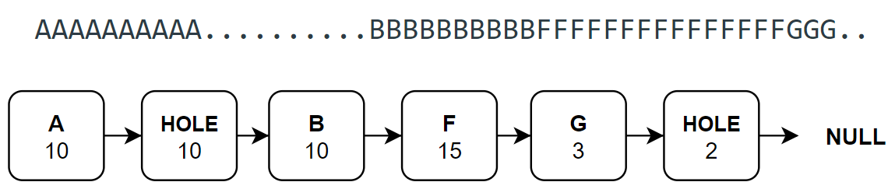
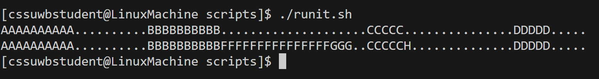

# Memory Allocation Project
Please see https://github.com/MaryamM4/Contiguous-Memory-Allocation.git

## Execution Instructions

**Navigate to the scripts directory:**
   ```
   cd scripts
   ```
**Make the runit.sh script executable:**
   ```
   chmod +x runit.sh
   ```
**Run the script:**
   ```
   ./runit.sh
   ```
   
*Note:* To execute a different script, change the filename in the runit.sh script accordingly.

## Implementation
- This project implements contiguous memory allocation for a fixed pool of 80 bytes using three algorithms: 
    - **First-Fit:** Selects the first hole that is large enough.
    - **Best-Fit:** Chooses the smallest hole that fits.
    - **Worst-Fit:** Picks the largest available hole.

- The memory pool is implemented as a linked list of memory blocks (allocated segments and holes). 
    

- When a process requests memory, the algorithm searches the list for a suitable hole.
    Allocations split holes if necessary, 
    while process deallocations convert allocated blocks back into holes and merge adjacent free blocks. 

- Compaction shifts allocated blocks to the start of the pool and consolidates holes into a node at the end.


## Output
For the input script s1.txt:
'''
A A 10 F
A X 10 F
A B 10 F
A X 20 F
A C 5 F
A X 15 F
A D 5 F
F X
S
A E 25 F
A F 15 F
A G 3 B
A H 1 W
S
C
E
'''

the output is:
